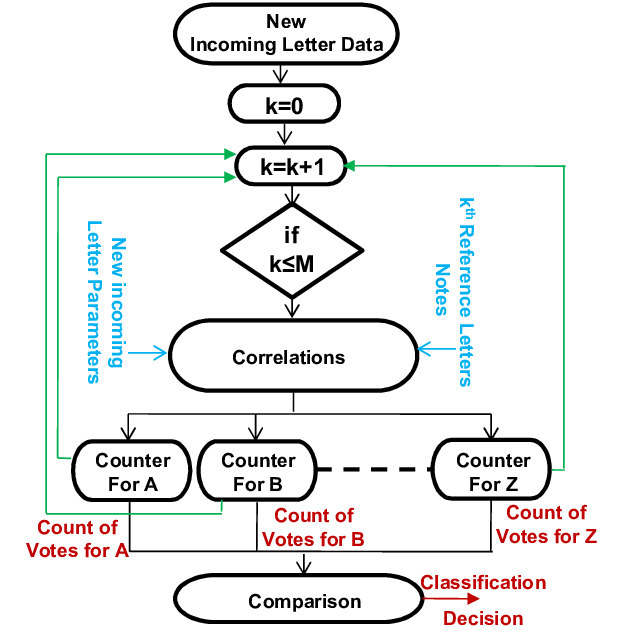
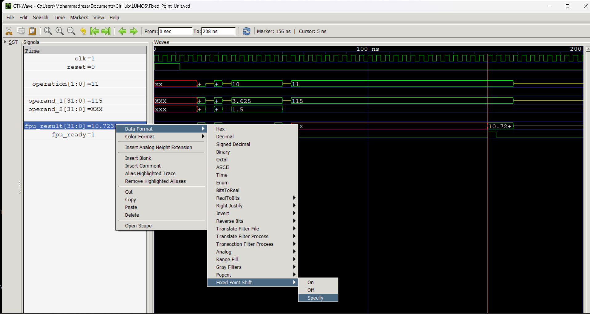

Name:Mohammadreza_Validokht_Asl_400414111
Name:Mohammadreza_Nazari_400413404
Date : 07/03/2024
# Computer Organization - Spring 2024
# Iran Univeristy of Science and Technology


# Fixed Point Unit README

## Overview
This repository contains the implementation of a Fixed Point Unit (FPU) designed for performing basic arithmetic operations including addition, subtraction, multiplication, and square root calculation on fixed-point numbers. The module is implemented in Verilog and includes a testbench for simulation.

## File Structure
- `Fixed_Point_Unit.v`: The main Verilog module implementing the Fixed Point Unit.
- `Fixed_Point_Unit_Testbench.v`: Testbench for simulating and verifying the Fixed Point Unit.
- `Assembly.s`: Assembly code used for testing the FPU.
- `Assembly.txt`: Corresponding machine code for `Assembly.s`.
- `Defines.vh`: Header file containing operation definitions.
- `waveform.vcd`: Waveform file generated from the simulation (to be created).

## Bit Selection for Multiplication Result
In the `Fixed_Point_Unit` module, the multiplication result is selected using:
```verilog
result <= product[WIDTH + FBITS - 1 : FBITS];
```
This selection extracts the significant bits from the product by shifting out the fractional bits. Here, `WIDTH` is the bit width of the operands, and `FBITS` is the number of fractional bits. This ensures the fixed-point representation is maintained by discarding the lower bits which represent values smaller than the least significant bit of the result.

## Implementation of the 32-bit Multiplier
### Partial Product Generation
The 32-bit multiplier is implemented using a 16-bit multiplier module. The multiplication process is broken into smaller parts:
1. **Partial Products**:
   - `P1`: Lower 16 bits of both operands (`A1 * B1`).
   - `P2`: Upper 16 bits of operand 1 and lower 16 bits of operand 2 (`A2 * B1`).
   - `P3`: Lower 16 bits of operand 1 and upper 16 bits of operand 2 (`A1 * B2`).
   - `P4`: Upper 16 bits of both operands (`A2 * B2`).

### Final Addition
The partial products are shifted appropriately and added together:
```verilog
product <= P1 + (P2 << 16) + (P3 << 16) + (P4 << 32);
```
This combination of partial products yields the final 64-bit product result.

## Implementation of the Square Root Calculator
### Algorithm

The square root calculator uses an iterative method similar to the non-restoring square root algorithm:
1. **Initialization**: Start with the operand and initialize variables.
2. **Iterative Calculation**:
   - Perform test subtraction.
   - Update remainder and accumulator based on the test result.
   - Shift and adjust the quotient.
3. **Completion**: After the required iterations, the quotient holds the square root result.

### Fixed-Point Handling
The algorithm considers fixed-point representation by shifting bits appropriately to handle fractional parts during iterations.

## Analysis of `Assembly.s`
### Sections and Purpose
1. **Initialization**:
   ```assembly
   li sp, 0x3C00       # Load immediate value 0x3C00 into stack pointer
   addi gp, sp, 392    # Set global pointer to sp + 392
   ```

2. **Main Loop**:
   ```assembly
   loop:
   flw f1, 0(sp)       # Load floating point word from memory at sp to f1
   flw f2, 4(sp)       # Load floating point word from memory at sp + 4 to f2
   fmul.s f10, f1, f1  # Multiply f1 by itself, store result in f10
   fmul.s f20, f2, f2  # Multiply f2 by itself, store result in f20
   fadd.s f30, f10, f20# Add f10 and f20, store result in f30
   fsqrt.s x3, f30     # Calculate square root of f30, store result in f3
   fadd.s f0, f0, f3   # Add f3 to f0
   addi sp, sp, 8      # Increment stack pointer by 8
   blt sp, gp, loop    # Loop if sp < gp
   ebreak              # End of program
   ```

### Value Loading
- Values are loaded from the memory location pointed to by the stack pointer (`sp`).

### Calculation Steps
1. Load two values into `f1` and `f2`.
2. Perform multiplication to obtain squares of `f1` and `f2`.
3. Sum the squares and compute the square root.
4. Accumulate the result in `f0`.

### Final Result Register
- The final result of the accumulated distances is stored in the `f0` register.

## Waveform Analysis
(To be added with actual waveform images and explanation.)

## Detailed Explanation of Modules
### Square Root Calculator
- **States**: `SQRT_IDLE`, `SQRT_START`, `SQRT_CALC`, `SQRT_DONE`.
- **Logic**: Uses iterative subtraction and shifting to compute the square root.
- **Fixed-Point Handling**: Shifts operands to manage fractional parts.

### Multiplier
- **Partial Product Generation**: Utilizes a 16-bit multiplier for generating four partial products.
- **Final Addition**: Combines partial products with appropriate shifts to form the final 64-bit result.

## Bonus Point Task: Pipelining the Multiplier (If Implemented)
### Approach
- **Pipelining Stages**: Split the multiplication process into stages to overlap execution.
- **Performance Improvement**: Reduces overall latency by processing multiple multiplication steps concurrently.

---

This README provides an overview, detailed explanations, and analysis of the provided code and its functionality.


# Pictures of waveform in GKTWAVE
## Initial 

## Sum in Decimal

## Sub in Decimal

## Mul in Decimal

## specify 

### The Reason that we use Specify 
Unlike other operations, in the case of squaring, the floating point must be modified, and this modification is specified based on our Qi.f.
## sqrt in Decimal

## Sum in Hex

## Sub in Hex

## Mul in Hex

## sqrt in Hex
